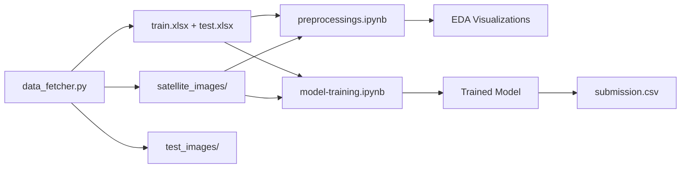

# 🏠 Satellite Imagery-Based Property Valuation

A multimodal deep learning approach to real estate valuation using satellite imagery and tabular data. This project combines **EfficientNet-B0** (CNN) for visual feature extraction with **CatBoost** for final price prediction, achieving **R² = 0.91** on the validation set.


## 📊 Model Performance

| Model | R² Score | RMSE |
|-------|----------|------|
| Tabular NN Only | -18.96 | $1,556k |
| CNN + MLP | 0.7844 | $162k |
| CNN + MLP + XGBoost | 0.8774 | $122k |
| **CNN + MLP + CatBoost + KNN** | **0.9073** | **$106k** |

## 🏗️ Architecture

```
[Satellite Image] → [EfficientNet-B0] → [1280-dim] ─┐
                                                     ├→ [1310-dim Feature Vector] → [CatBoost] → Price
[Tabular + KNN Features] ────────────→ [22-dim]  ───┤
                                                     │
[Zipcode] → [Embedding Layer] ────────→ [8-dim]  ───┘
```

## 📁 Project Structure

```
Satellite-Imagery-Based-Property-Valuation-/
├── Final_Code_Files/
│   ├── data_fetcher.py        # Downloads train/test data & satellite images
│   ├── preprocessings.ipynb   # EDA, feature engineering, visualizations
│   ├── model-training.ipynb   # Model training, evaluation, submission
│   ├── requirements.txt       # Python dependencies
│   ├── .env                   # API keys (create this file)
│   ├── train.xlsx             # Generated by data_fetcher.py
│   ├── test.xlsx              # Generated by data_fetcher.py
│   ├── satellite_images/      # ~21,000 training images
│   └── test_images/           # Test images
└── README.md
```

---

## 🚀 Setup Instructions

### Option 1: Local Environment

#### Step 1: Clone Repository
```bash
git clone https://github.com/ankit-raj00/Satellite-Imagery-Based-Property-Valuation-.git
cd Satellite-Imagery-Based-Property-Valuation-
```

#### Step 2: Install Dependencies
```bash
pip install -r requirements.txt
```

#### Step 3: Create `.env` File
Create a `.env` file in the project root with your Google Maps API key:
```
GOOGLE_MAPS_API_KEY=your_api_key_here
```

> **Note:** You need a Google Maps Static API key to download satellite images. Get one from [Google Cloud Console](https://console.cloud.google.com/).

#### Step 4: Download Data & Images
```bash
cd Final_Code_Files
python data_fetcher.py
```

This will:
- Download `train.xlsx` and `test.xlsx`
- Create `satellite_images/` folder with ~21,000 training images
- Create `test_images/` folder with test images

#### Step 5: Run Preprocessing
Open `preprocessings.ipynb` in Jupyter and run all cells. This generates:
- EDA visualizations
- Feature correlations
- Price distribution analysis

#### Step 6: Train Model
Open `model-training.ipynb` in Jupyter and run all cells. This will:
- Train the CNN + MLP baseline model
- Extract features and train CatBoost
- Generate `submission.csv`

---

### Option 2: Kaggle Environment

#### Step 1: Prepare Datasets
Since Kaggle doesn't support the data_fetcher script, you need to **upload datasets manually**:

1. **Run `data_fetcher.py` locally first** to generate:
   - `train.xlsx`
   - `test.xlsx`
   - `satellite_images/` folder
   - `test_images/` folder

2. **Create Kaggle Datasets:**
   - Upload `train.xlsx` and `test.xlsx` as one dataset
   - Upload `satellite_images/` folder as another dataset (rename to `dataset`)
   - Upload `test_images/` folder as another dataset

#### Step 2: Upload Notebooks
Upload both notebooks to Kaggle:
- `preprocessings.ipynb`
- `model-training.ipynb`

#### Step 3: Add Datasets to Notebook
In your Kaggle notebook, add the uploaded datasets. The code auto-detects Kaggle environment:

```python
# This runs automatically in the notebook
if os.path.exists("/kaggle/input"):
    print("Environment: Kaggle Detected")
    # Searches /kaggle/input for train.xlsx, test.xlsx, and images
```

#### Step 4: Run Notebooks
1. Run `preprocessings.ipynb` first (for EDA)
2. Run `model-training.ipynb` (for training + submission)

#### Expected Kaggle Input Structure:
```
/kaggle/input/
├── your-data-dataset/
│   ├── train.xlsx
│   └── test.xlsx
├── satellite-images-dataset/
│   └── dataset/           # or satellite_images/
│       ├── 7129300520.jpg
│       ├── 6414100192.jpg
│       └── ... (21,000+ images)
└── test-satellite-image/
    └── test_images/
        ├── 123456.jpg
        └── ...
```

---

## 📝 Workflow Summary



## 🔧 Key Features

- **Spatial KNN Features:** Captures neighborhood pricing trends
  - `neighbor_price`: Average price of 10 nearest properties
  - `neighbor_size`: Average sqft of 10 nearest properties

- **Zipcode Embeddings:** Learned 8-dimensional geographic representations

- **Grad-CAM Visualization:** Visual explainability showing what the model "sees"

## 📊 Key Files Output

| File | Description |
|------|-------------|
| `best_multimodal_model.pt` | Trained CNN + MLP weights |
| `catboost_model.cbm` | Trained CatBoost model |
| `submission.csv` | Final predictions for test data |

## 🎯 Results Interpretation

The model learns to distinguish:
- **High-Value Properties:** Vegetation, large setbacks, curvilinear roads
- **Low-Value Properties:** Grid patterns, high density, concrete dominance

## 📄 License

MIT License

## � Contact

For any issues with cloning, setup, or questions about the project:
- **Email:** punit_d@ch.iitr.ac.in

## �🙏 Acknowledgments

- EfficientNet architecture by Google
- CatBoost by Yandex

